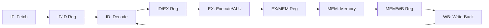
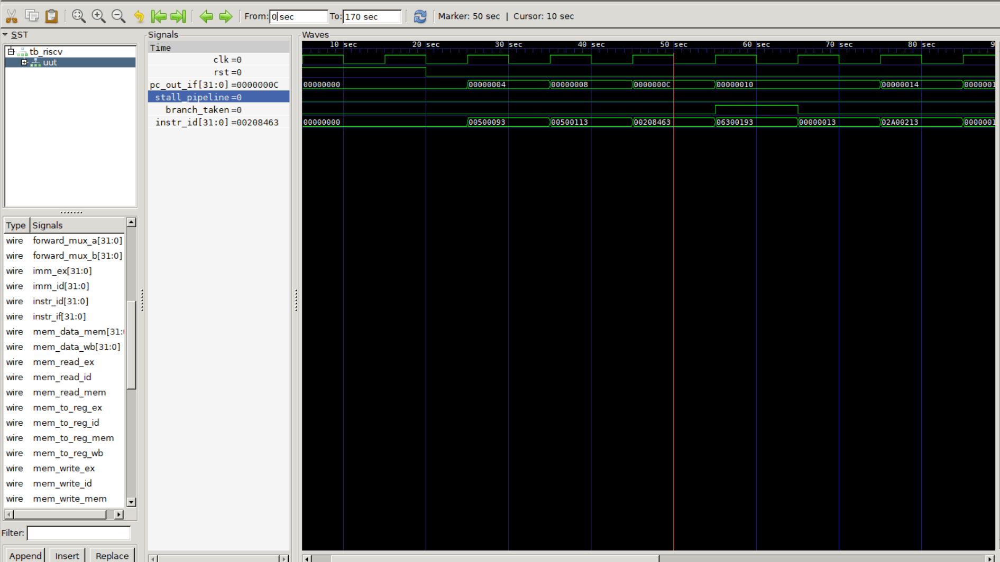

# 5-Stage Pipelined RISC-V Processor (RV32I)

## 🚀 Overview

This project is a synthesizable, single-issue **32-bit RISC-V Processor** implemented with a 5-stage pipeline. Designed from scratch in Verilog, it features an advanced hazard management system including **Forwarding**, **Stalling**, and **Pipeline Flushing** to ensure high instruction throughput and computational integrity.

**Key Engineering Focus:**

-   **Instruction Parallelism:** Overlapping 5 distinct instructions in the pipeline.
-   **Data Hazard Resolution:** Implementing combinational forwarding paths to minimize stalls.
-   **Control Hazard Management:** Handling branch speculation and pipeline recovery.
-   **Hardware Verification:** Timing-accurate analysis via Icarus Verilog and GTKWave.

---

## 🧠 Architecture

The processor implements the classic **RV32I base integer instruction set**. To maximize performance, the core is partitioned into five distinct stages separated by pipeline registers.

### **Pipeline Stages**

1.  **IF (Instruction Fetch):** Retrieves the 32-bit instruction from memory and manages the Program Counter.
2.  **ID (Instruction Decode):** Parses the instruction, generates control signals, and reads from the dual-ported Register File.
3.  **EX (Execute):** Performs arithmetic/logic operations and houses the **Forwarding Multiplexers**.
4.  **MEM (Memory Access):** Handles synchronous data reads and writes for Load/Store operations.
5.  **WB (Write-Back):** Commits results back to the Register File, completing the instruction cycle.



---

## ⚡ Hazard Management & Microarchitecture Decisions

In a pipelined processor, instruction overlap introduces structural, data, and control hazards. Below are the engineering decisions and hardware logic implemented to guarantee hazard-free execution.

### 1. Data Hazards & Forwarding
A data hazard occurs when an instruction depends on the result of a previous instruction that has not yet completed its write-back stage. 
To resolve RAW (Read-After-Write) dependencies without adding stall cycles, **Forwarding Multiplexers** are added to the input of the ALU in the Execute (EX) stage.

*   **EX-to-EX Forwarding:** If a previous EX instruction writes to a register needed by the current EX instruction, the ALU result from the EX/MEM pipeline register is immediately routed to the ALU input.
*   **MEM-to-EX Forwarding:** If an instruction from two cycles ago writes to a register needed by the current EX instruction, the write-back data from the MEM/WB pipeline register is forwarded.

### 2. Load-Use Hazards & Stalling
When an instruction immediately following a `LW` (Load Word) instruction reads the loaded register, forwarding is physically impossible because the data is not fetched from memory until the end of the MEM stage. This is a **Load-Use Hazard**.

*   **Detection Logic:**
    ```verilog
    assign load_use_hazard = (id_ex_mem_read && ((id_ex_rd == if_id_rs1) || (id_ex_rd == if_id_rs2)));
    ```
*   **Resolution:** The hardware automatically injects a **1-cycle stall** by:
    1.  Disabling writes to the Program Counter (PC) to keep it pointing to the blocked instruction.
    2.  Disabling writes to the IF/ID pipeline register to prevent decoding the next instruction.
    3.  Asserting a `stall` control signal that flushes the ID/EX register (injecting a `NOP` bubble into the pipeline).

### 3. Control Hazards & Branch Flushing
Branches (`BEQ`, `BNE`, etc.) introduce control hazards because the target address and outcome are decided during the Execute stage. 

*   **Speculation Policy:** Predict-Not-Taken. The processor continues fetching instructions sequentially (`PC + 4`).
*   **Misprediction Recovery:** If the branch evaluates to **taken** in the EX stage, the hardware immediately:
    1.  Calculates the target branch address and loads it into the PC.
    2.  Flushes the **IF/ID** and **ID/EX** pipeline registers, converting the speculatively fetched instructions into harmless `NOP` bubbles (2-cycle penalty).

---

## 🧪 Verification & Simulation

The processor was verified using timing-accurate RTL simulation with Icarus Verilog, and the output waveform was visualized via GTKWave.

### Verification Matrix
The testbench validates correct execution of all pipeline stages, hazard forwarding paths, load-use stalls, and branch flushes.

| Test Case | Objective | Expected Outcome | Status |
| :--- | :--- | :--- | :---: |
| **Arithmetic Sequence** | Verify EX-EX and MEM-EX forwarding under back-to-back dependency. | Correct registers updated in Register File without any stalls. | **Passed** |
| **Load-Use Sequence** | Verify that a `LW` followed by a dependent `ADD` triggers a 1-cycle stall. | Stall signal asserted for exactly 1 cycle; correct data loaded and forwarded. | **Passed** |
| **Branch Taken** | Verify that a taken branch redirects the Program Counter and flushes speculative instructions. | PC updated to target; two subsequent instructions replaced by `NOP` (bubbles). | **Passed** |

### Waveform Analysis
The simulation waveform below showcases the exact timing relationship during a branch redirection and pipeline flush:



*   **PC and Instruction Alignment:** At simulation timestamp `105ns`, the Branch execution calculates the correct target.
*   **Stall & Flush Waveforms:** Notice the `flush` control signal pulsing high, causing the current speculative instruction in the fetch stage to clear, preserving state consistency.

---


